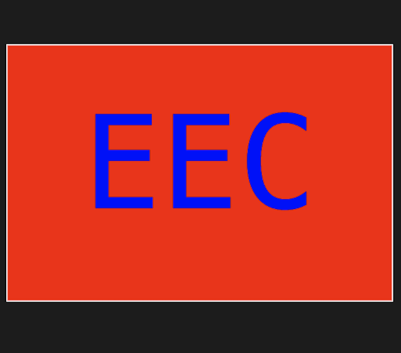

# SVG Logo Generator

## Description 

The purpose of this project is to create an SVG logo using the command-line interface (CLI) in a Node.js environment. The project uses object-oriented programming (OOP) principles to organize the code and make it more maintainable. Jest is used as the testing framework to ensure that the code works as intended, and Requirer is used as a dependency management tool to manage the project's dependencies.

### **CLI**
The CLI is used in this project to provide a user-friendly interface to create an SVG logo. By running the command-line interface, users can provide input values such as the logo name, logo color, and logo size, which are then used to generate the SVG logo.

### **OOP**
Object-oriented programming (OOP) is used in this project to organize the code into reusable and modular classes. The classes are designed to have clear responsibilities and to encapsulate the logic required to create an SVG logo. This makes the code more maintainable and easier to extend in the future.

### **Jest**
Jest is a testing framework used in this project to ensure that the code works as intended. Jest provides a way to write automated tests that can be run whenever changes are made to the codebase. This helps to catch any errors or issues early in the development process.

### **Requirer**
Requirer is used in this project as a dependency management tool to manage the project's dependencies. It simplifies the process of installing and updating dependencies by providing a centralized way to manage them. This helps to ensure that the project uses the correct versions of its dependencies and that they are up-to-date.

## Table of Contents 

* [Installation](#installation)
* [Usage](#usage)
* [Credits](#credits)
* [License](#license)

## Installation

### Node JS

1. Download and install the Node.js package from the official website: https://nodejs.org/en/
2. Follow the instructions on the website to install the package. 
3. Once installed, open the terminal of your operating system to confirm that Node.js has been successfully installed by typing 'node -v' and press enter. This should return the version number of Node.js installed. 
4. Congratulations! You have successfully set up Node.js.  

### RequireJS:

1. Open your project in the terminal/command prompt
2. Type the following command: npm install requirejs
3. Press Enter to install the package.
4. RequireJS is now installed in your project.
 [Visit Requirer](https://requirejs.org/)

### Jest:

1. Open your project in the terminal/command prompt.
2. Type the following command: npm install jest
3. Press Enter to install the package.
4. Jest is now installed in your project
[Visit Jest]( https://jestjs.io/)

# Usage 

## Video guide

- [cruzkenneth504-Youtube]()  

## Images

### Circle

### Triangle

### Square

# Video guide

- [cruzkenneth504-Youtube]()  

## License

## Credits
 - 

## Badges

## **Author**

* **Kenneth Cruz** 
 
- [Link to Github](https://github.com/cruzkenneth504)
- [Link to LinkedIn](linkedin.com/in/cruzkenneth504)

## **Acknowledgments**

* [UCB BootCamp](https://bootcamp.berkeley.edu/)
* [DevTools](https://dev.to/)
* [Youtube](https://www.youtube.com/)
* [Bootcamp Inatructors](https://bootcamp.berkeley.edu/)
* [Tutors]( https://tinyurl.com/BootCampTutorTeam)
 

